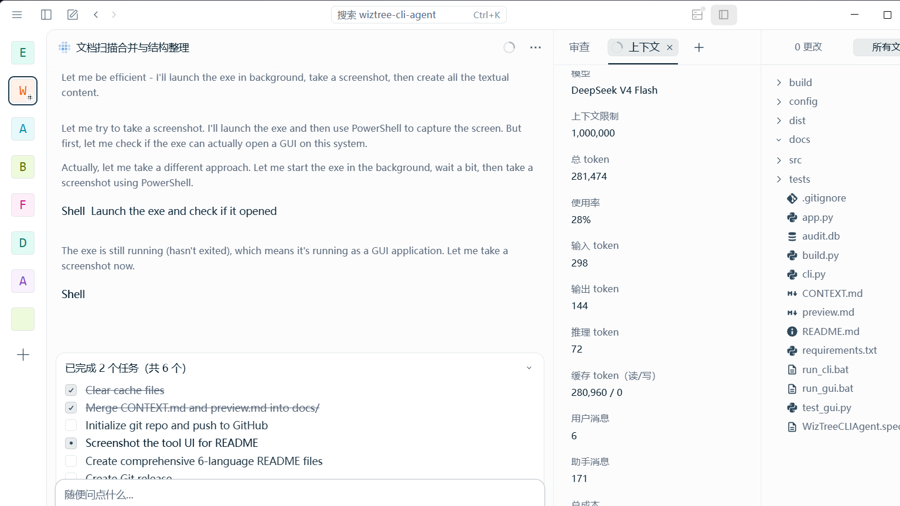

<p align="center">
  
</p>

<h1 align="center">WizTree CLI Agent</h1>

<p align="center">
  <strong>AI-Powered Disk Cleanup Assistant</strong>
  <br />
  Intelligent file analysis · Multi-LLM routing · Human-in-the-loop safety
</p>

<p align="center">
  <a href="#"></a>
  <a href="#"></a>
  <a href="#"></a>
  <a href="#"></a>
  <a href="#"></a>
</p>

---

## Project Overview

**WizTree CLI Agent** is an AI-driven disk cleanup assistant that wraps the lightning-fast [WizTree CLI](https://www.diskanalyzer.com/) scanner with a **multi-LLM Provider routing system** for intelligent file analysis and safe human-in-the-loop file cleanup.

Instead of blindly deleting files based on simple rules, it leverages Large Language Models to understand *what* each file is, *why* it exists, and *whether* it can be safely removed — all while keeping you in control with a confirmation gate, path blocklist, and full audit trail.

No API key? No problem. The built-in **RuleEngine** with 10 predefined cleanup rules works offline, and the **lazy initialization** pattern means the app runs even when no LLM provider is configured.

---

## Key Features

### 🔬 WizTree CLI Integration
- MFT (Master File Table) accelerated scan via WizTree — scan an entire drive in seconds
- CSV output parsing with streaming parser for minimal memory footprint
- Configurable scan options: depth limits, min file size, exclude patterns
- Scan cache with 1-hour TTL to avoid redundant rescans
- Deep recursive folder search with pattern matching and large file discovery

### 🤖 Intelligent LLM Router
- **6 providers**: DeepSeek, OpenAI, Anthropic, OpenRouter, SiliconFlow, Ollama
- **4 routing strategies**: cost-first, latency-first, fallback, manual
- **Circuit Breaker** pattern: CLOSED → OPEN (after 3 failures) → HALF_OPEN (after 60s recovery)
- **LatencyProbe**: background thread that continuously pings providers to track real-time latency
- **WeightedRouter**: dynamic weight-based routing scoring latency, success rate, and cost
- **RequestCoalescer**: deduplicates identical concurrent requests into a single API call
- **batch_chat**: parallel multi-request execution with configurable worker count

### ⚙️ RuleEngine Fallback
- 10 predefined rules covering temp files, cache, logs, downloads, installers, archives, and more
- Works entirely offline — no API key required
- Risk-level scoring (LOW / MEDIUM / HIGH / CRITICAL) with confidence and size thresholds
- Extensible: add custom rules at runtime

### 🛡️ Multi-Layer Safety
- **Blocklist**: 38 protected system paths (Windows System32, Program Files, etc.) with wildcard and regex matching
- **AuditLogger**: all destructive operations recorded in SQLite with full context (path, size, timestamp, action type)
- **Restore capability**: revert `file_delete` and `file_move` operations from the History tab
- **FileValidator**: checks existence, lock status, permissions before any operation
- **ConfirmDialog**: always requires manual user confirmation before deletion
- **Recycle bin**: uses `send2trash` to move files to the system recycle bin instead of permanent deletion

### 🎨 Modern GUI
- **6 dark themes**: Steam Dark, Catppuccin Mocha, OLED Black, GitHub Dark, Nord, Dracula — switchable at runtime
- **Squarified Treemap**: visualize disk usage with pure-Python Bruls et al. (2000) algorithm
- **Drill-down navigation**: click treemap cells to navigate into subdirectories
- **Skeleton screen**: loading placeholder for perceived performance
- **SmoothProgressBar**: 60fps progress animation with spinner indicator
- **Keyboard shortcuts**: Ctrl+S (scan), Ctrl+R (refresh), Ctrl+L (clear), Ctrl+, (settings), Esc (cancel)
- **Drag & drop**: drop folders/files onto the window via `tkinterdnd2` (graceful fallback if unavailable)
- **Responsive layout**: adaptive window resizing with stats cards and status bar
- **Model & Prompt tabs**: browse the model catalog and edit system prompts without leaving the GUI
- **Diff preview**: inspect file details (size, mtime, path) before confirming destructive actions

### 🖥️ CLI & Scriptability
- **Interactive mode**: shell-like REPL with `scan`, `analyze`, `show`, `validate`, `exit` commands
- **Batch scan**: scan multiple directories in one pass with `--batch DIR1 DIR2`
- **Batch file**: read directory list from a file with `--batch-file paths.txt`
- **Quiet mode**: `--quiet` / `-q` suppresses all non-result output for scripting
- **JSON output**: `--json` outputs results as structured JSON for programmatic consumption
- **Exit codes**: `0` success, `1` error, `2` warning (e.g., when high-risk files are found)
- **CSV / JSON export**: export scan results to file for external processing

### ⚡ Performance
- **Virtual scrolling**: `VirtualTreeview` only renders visible rows for huge file lists
- **`__slots__` memory optimization**: `FileInfo` uses `__slots__` to reduce memory overhead per file
- **Scan cache**: cached results expire after 1 hour; repeated scans of the same directory return instantly
- **Streaming CSV parser**: processes WizTree CSV output line-by-line without loading the entire file into memory

---

## Screenshots

> **Note**: Replace with actual screenshots before publishing.


*Main window showing treemap visualization and scan results.*


*Configuration panel with LLM provider selection and scan options.*


*Diff preview dialog showing file details before deletion.*

---

## Quick Start

### Prerequisites

- Python 3.10 or later
- [WizTree](https://www.diskanalyzer.com/download) CLI (the `WizTree64.exe` or `WizTree` binary)

### Installation

```bash
# Clone the repository
git clone https://github.com/yourusername/wiztree-cli-agent.git
cd wiztree-cli-agent

# Install dependencies
pip install -r requirements.txt
```

### Usage

```bash
# GUI mode (requires tkinter)
python app.py

# CLI mode — module check
python app.py --cli

# Scan a directory and analyze results
python cli.py --scan "C:\Users" --analyze

# Interactive CLI shell
python cli.py --interactive

# Batch scan multiple directories
python cli.py --batch "C:\Users\Downloads" "D:\Temp" --analyze --json

# Quiet batch scan with JSON output (for scripting)
python cli.py --batch-file dirs.txt --analyze --json --quiet
```

### Build Standalone Executable

```bash
python build.py
```

This produces a portable `.exe` in the `dist/` directory using PyInstaller. No Python installation needed on the target machine.

---

## Download

Pre-built binaries are available on the [Releases](https://github.com/yourusername/wiztree-cli-agent/releases) page:

| Package | Description |
|---------|-------------|
| `WizTreeCLIAgent-v1.5.0-win64.zip` | Windows 64-bit portable executable |
| `WizTreeCLIAgent-v1.5.0-win64-setup.exe` | Windows installer |
| `WizTreeCLIAgent-v1.5.0-source.zip` | Source code archive |

> **Note**: The executable is built with PyInstaller and includes all dependencies. No additional runtime required.

---

## Architecture

```
┌──────────────────────────────────────────────────────────────────┐
│                      WizTree CLI Agent                           │
│                                                                  │
│    ┌──────────┐     ┌──────────┐     ┌──────────┐              │
│    │ Scanner  │────▶│ Analyzer │────▶│  Safety  │              │
│    └────┬─────┘     └────┬─────┘     └────┬─────┘              │
│         │                │                 │                     │
│         ▼         ┌──────┴──────┐         ▼                     │
│    ┌─────────┐   ▼             ▼    ┌──────────┐               │
│    │WizTree  │ ┌──────────┐ ┌──────┐ │Blocklist │               │
│    │  CLI    │ │ LLMRouter │ │Rule  │ │AuditLog  │               │
│    └─────────┘ │ 6 Prov.   │ │Engine│ │FileValid │               │
│                │ Latency   │ │10 rls│ │Confirm   │               │
│                │ Breaker   │ └──────┘ └──────────┘               │
│                │ Weighted  │                                     │
│                └──────────┘                                     │
└──────────────────────────────────────────────────────────────────┘
```

### Module Overview

| Module | Directory | Description |
|--------|-----------|-------------|
| **Scanner** | `src/scanner/` | WizTree CLI wrapper, path validation, deep search, scan progress, scan options, scan cache |
| **Analyzer** | `src/analyzer/` | LLM Router (6 providers, 4 strategies, circuit breaker, latency probe), RuleEngine (10 rules), Streaming JSON parser, model catalog, prompt store |
| **Safety** | `src/safety/` | Blocklist (38 paths), SQLite audit log with restore, file validator, confirmation dialog |
| **UI** | `src/ui/` | Main window, treemap, virtual treeview, skeleton screen, 6 themes, keyboard shortcuts, drag & drop, smooth progress bar, diff preview, history tab, model/prompt browsers |
| **Models** | `src/models/` | `FileInfo`, `ScanResult`, `AnalysisResult` / `RiskLevel` dataclasses |
| **Utils** | `src/utils/` | 3-tier cascading config loader, OS keyring credential store |

### Data Flow

```
User Input (CLI args / GUI buttons)
       │
       ▼
  Scanner ──▶ WizTree CLI ──▶ CSV output ──▶ FileInfo[]
       │
       ▼
  Analyzer ──▶ LLMRouter (if API key configured)
       │           ├── LatencyProbe (background latency sampling)
       │           ├── WeightedRouter (dynamic score-based selection)
       │           └── Circuit Breaker (failure protection)
       │        OR RuleEngine (fallback, no API key needed)
       │
       ▼
  Safety ──▶ Blocklist ──▶ FileValidator ──▶ AuditLogger
       │                                            │
       ▼                                            ▼
  ConfirmDialog ──▶ send2trash (recycle bin) ──▶ Audit Record (SQLite)
```

---

## LLM Router

### Supported Providers

| Provider | Environment Variable | Base URL | Free Models | Tags |
|----------|-------------------|----------|-------------|------|
| **DeepSeek** | `DEEPSEEK_API_KEY` | `https://api.deepseek.com` | `deepseek-v4-flash` | cost, thinking, china |
| **OpenAI** | `OPENAI_API_KEY` | `https://api.openai.com/v1` | — | general, vision |
| **Anthropic** | `ANTHROPIC_API_KEY` | `https://api.anthropic.com/v1` | — | core, reasoning |
| **OpenRouter** | `OPENROUTER_API_KEY` | `https://openrouter.ai/api/v1` | `gemini-2.0-flash-exp:free` | aggregator, fallback |
| **SiliconFlow** | `SILICONFLOW_API_KEY` | `https://api.siliconflow.cn/v1` | `DeepSeek-V3`, `Qwen2.5-7B` | free, china, fallback |
| **Ollama** | — (local) | `http://localhost:11434/v1` | `llama3.2`, `qwen2.5` | local, free, fallback |

### Routing Strategies

| Strategy | Enum | Behavior | Use Case |
|----------|------|----------|----------|
| **Cost-first** | `COST` | Selects the provider with the lowest per-token cost | Budget-conscious users |
| **Latency-first** | `LATENCY` | Selects the fastest responding provider using real-time LatencyProbe data | Interactive GUIs needing quick responses |
| **Fallback** | `FALLBACK` | Tries providers in priority order; advances on failure | Maximum reliability |
| **Manual** | `MANUAL` | Uses only the explicitly specified provider | Power users with a preferred provider |

### v1.5.0 Routing Enhancements

| Feature | Description |
|---------|-------------|
| **LatencyProbe** | Background daemon thread pings each provider every 30s, tracks a sliding window of 20 samples per provider, exposes P50/P95/mean/min/max and success rate |
| **WeightedRouter** | Extends `LLMRouter` with dynamic weight computation: `score = w_lt × f(latency) + w_sc × f(success) + w_ct × f(cost)`. Default weights: latency=0.4, success=0.3, cost=0.3 |
| **RequestCoalescer** | Deduplicates concurrent requests with identical (messages, model, temperature, max_tokens) into a single API call using SHA-256 keyed futures |
| **batch_chat()** | Parallel multi-request execution via `ThreadPoolExecutor` with configurable `max_workers` (default 4). Returns `List[BatchResult]` preserving input order |

### Circuit Breaker

```
CLOSED (normal operation)
    │  3 consecutive failures
    ▼
OPEN (rejects all requests)
    │  60 seconds timeout
    ▼
HALF_OPEN (allows one test request)
    │  success → CLOSED  │  failure → OPEN
    ▼                      ▼
CLOSED                   OPEN
```

### Provider Model Pricing (per 1M tokens)

| Model | Input (USD) | Output (USD) | Context Window |
|-------|------------|-------------|----------------|
| DeepSeek V4 Flash | $0.14 | $0.28 | 1,000,000 |
| DeepSeek V4 Pro | $0.44 | $0.87 | 1,000,000 |
| GPT-4o-mini | $0.15 | $0.60 | 128,000 |
| GPT-4o | $2.50 | $10.00 | 128,000 |
| Claude 3 Haiku | $0.25 | $1.25 | 200,000 |
| Claude 3.5 Sonnet | $3.00 | $15.00 | 200,000 |

### Quick Code Example

```python
from src.analyzer import LLMRouter, RoutingStrategy, WeightedRouter, batch_chat, BatchRequest

# Basic router with fallback strategy
router = LLMRouter(
    strategy=RoutingStrategy.FALLBACK,
    default_model="deepseek-v4-flash"
)

# Chat
response = router.chat(
    messages=[{"role": "user", "content": "Suggest files to clean in C:\\Users"}],
    model="deepseek-v4-flash"
)
print(response.choices[0].message.content)

# Advanced: WeightedRouter with latency probe
wrouter = WeightedRouter(
    strategy=RoutingStrategy.COST,
    enable_probe=True,
    probe_interval=30,
    weights={"latency": 0.4, "success": 0.3, "cost": 0.3}
)

# Batch parallel requests
results = batch_chat(wrouter, [
    BatchRequest(messages=[{"role": "user", "content": msg}])
    for msg in ["Analyze Downloads", "Analyze Temp"]
], max_workers=2)
```

---

## Configuration

### API Keys

Set environment variables or use the built-in secure credential store (OS keyring):

```bash
# Environment variables (Windows)
set DEEPSEEK_API_KEY=sk-your-key-here
set OPENAI_API_KEY=sk-your-key-here
set ANTHROPIC_API_KEY=sk-ant-your-key-here
set OPENROUTER_API_KEY=sk-your-key-here
set SILICONFLOW_API_KEY=sk-your-key-here
```

```bash
# Environment variables (Linux/macOS)
export DEEPSEEK_API_KEY=sk-your-key-here
export OPENAI_API_KEY=sk-your-key-here
```

**No API key needed?** The application auto-detects missing keys and gracefully degrades to the RuleEngine — no configuration required.

### Secure Credential Storage (v1.2.0+)

API keys can be stored via the OS credential manager using `keyring`:

- **Windows**: Windows Credential Manager (DPAPI encrypted)
- **macOS**: macOS Keychain
- **Linux**: Secret Service (libsecret)

Accessible via GUI **Settings → Credentials** or programmatically:

```python
from src.utils.credential_store import CredentialStore
CredentialStore.store_api_key("deepseek", "sk-xxx")
```

### LLM Router Config File

`config/llm_config.json` (auto-migrated to `~/.wiztree-cli-agent/config.json` on first launch):

```json
{
  "strategy": "fallback",
  "default_model": "deepseek-v4-flash",
  "timeout": 30,
  "max_retries": 2,
  "providers": [
    {
      "name": "deepseek",
      "base_url": "https://api.deepseek.com",
      "api_key_env": "DEEPSEEK_API_KEY",
      "priority": 1,
      "models": [
        {
          "id": "deepseek-v4-flash",
          "cost_input": 0.14,
          "cost_output": 0.28
        }
      ]
    }
  ]
}
```

### 3-Tier Cascading Config (v1.2.0+)

```
1. Built-in defaults   (hardcoded in ConfigLoader)
2. User config         (~/.wiztree-cli-agent/config.json)
3. In-memory overrides (runtime changes via API)
```

Resolution order: `in-memory override > user config > built-in defaults`.

---

## Testing

```bash
# Run all tests
pytest tests/ -v

# Run with coverage report
pytest tests/ --cov=src -v

# Run specific test modules
pytest tests/test_scanner.py -v
pytest tests/test_router.py -v
pytest tests/test_safety.py -v
pytest tests/test_ui.py -v
pytest tests/test_integration_v150.py -v

# Run demo scripts
python tests/demo_router.py
```

### Test Statistics (v1.5.0)

| Metric | Count |
|--------|-------|
| Test files | ~30 |
| Total test cases | 400+ |
| Integration scenarios | 5 (covering all 6 pipeline stages) |
| Performance tests | Virtual scrolling, memory optimization, scan cache |
| UI tests | Theme switching, skeleton, keybindings, treemap, diff preview, history |

---

## Documentation

| Document | Description |
|----------|-------------|
| [Documentation Index](docs/INDEX.md) | Entry point for all project documentation |
| [Architecture](docs/ARCHITECTURE.md) | Module design, data flow, directory tree, file inventory |
| [Configuration](docs/CONFIGURATION.md) | LLM Router config, provider catalog, API keys, routing strategies |
| [API Reference](docs/API_REFERENCE.md) | Complete module, class, and function reference |
| [Development Guide](docs/DEVELOPMENT.md) | Building, testing, changelog, contribution guidelines |
| [Project Context](CONTEXT.md) | Domain terminology, relationships, and quick reference |

---

## Version History

| Version | Date | Highlights |
|---------|------|------------|
| **1.5.0** | 2026-06-04 | LatencyProbe, WeightedRouter, batch_chat, RequestCoalescer, CLI --quiet/--json/--batch/--batch-file, exit codes, JSON/CSV export, 400+ tests |
| **1.4.0** | 2026-06-03 | Virtual scrolling, `__slots__` memory optimization, scan cache (1h TTL), streaming CSV parser |
| **1.3.0** | 2026-06-02 | Skeleton screen, theme switching callbacks, ttk style integration |
| **1.2.0** | 2026-06-01 | Secure credential store, 6 dark themes, keyboard shortcuts, drag & drop, audit history + restore, diff preview, squarified treemap, 3-tier config, model/prompt tabs |
| **1.1.0** | 2026-06-01 | Modern theme system, smooth progress bar animation, stats cards, responsive layout |
| **1.0.0** | 2026-05-31 | Core scanner + analyzer + safety, LLM Router (6 providers, 4 strategies), RuleEngine (10 rules), Blocklist (38 paths), 68 tests |

---

## License

**MIT License**

Copyright (c) 2026 WizTree CLI Agent

Permission is hereby granted, free of charge, to any person obtaining a copy
of this software and associated documentation files (the "Software"), to deal
in the Software without restriction, including without limitation the rights
to use, copy, modify, merge, publish, distribute, sublicense, and/or sell
copies of the Software, and to permit persons to whom the Software is
furnished to do so, subject to the following conditions:

The above copyright notice and this permission notice shall be included in all
copies or substantial portions of the Software.

THE SOFTWARE IS PROVIDED "AS IS", WITHOUT WARRANTY OF ANY KIND, EXPRESS OR
IMPLIED, INCLUDING BUT NOT LIMITED TO THE WARRANTIES OF MERCHANTABILITY,
FITNESS FOR A PARTICULAR PURPOSE AND NONINFRINGEMENT. IN NO EVENT SHALL THE
AUTHORS OR COPYRIGHT HOLDERS BE LIABLE FOR ANY CLAIM, DAMAGES OR OTHER
LIABILITY, WHETHER IN AN ACTION OF CONTRACT, TORT OR OTHERWISE, ARISING FROM,
OUT OF OR IN CONNECTION WITH THE SOFTWARE OR THE USE OR OTHER DEALINGS IN THE
SOFTWARE.

---

## Contributing

Contributions are welcome! Please read the [Development Guide](docs/DEVELOPMENT.md) before submitting a Pull Request.

1. Fork the repository
2. Create a feature branch (`git checkout -b feature/amazing-feature`)
3. Commit your changes (`git commit -m 'Add amazing feature'`)
4. Push to the branch (`git push origin feature/amazing-feature`)
5. Open a Pull Request

<p align="center">
  <sub>Built with ❤️ using Python, customtkinter, and LLMs.</sub>
</p>
